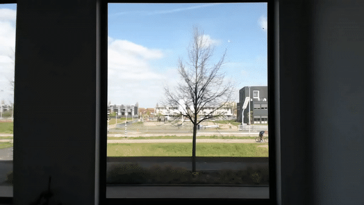

# timelapse




## Jupyter Notebook on Raspberry Pi:
```
ssh IP 
screen -s jupyter
conda activate timelapse
jupyter notebook --no-browser --port=PORT
```

then on local machine:
```
ssh -L PORT:localhost:PORT florian@IP
```


## To copy files from RaspberryPi to local machine over SSH:

```
scp florian@IP:/home/florian/timelapse/images/\* images/
```